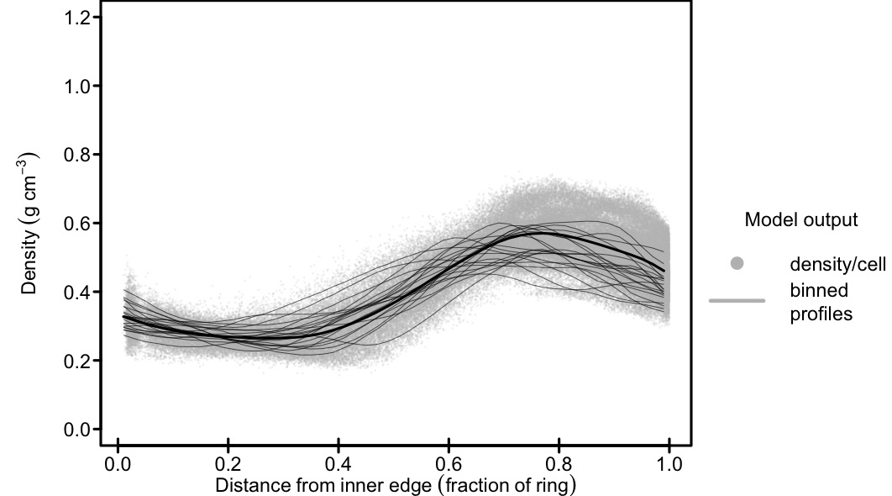

# RINGS_v3
RINGS code used for the Nature Communications resubmission.

The code can be compiled using the makefile, 

(note that macos users may have to specify
``LDLIBS = -L/Library/Developer/CommandLineTools/SDKs/MacOSX11.3.sdk/usr/lib``
and change the line 
``$(F90) $(FFLAGS) -o RINGS_v3.exe $(OBJ) $(LDFLAGS)``
to
``$(F90) $(FFLAGS) -o RINGS_v3.exe $(OBJ) $(LDLIBS)``

Execute the model doing ``./RINGS_v3.exe``

You will see the following output appear at runtime (here run for Tornetrask):

```
 Running RINGS_v3...
 Running for Tornetrask        1901        2020
     -5.5000   1168.2126     62.0404      0.3955      0.5605     31.7500
 RINGS_v3 finished cleanly...
```

'driver.txt' contains the site name., either 'Uggla' or 'Tornetrask'

Please email me if you would like to know about this project: adf10@cam.ac.uk


## Create example plots from model outputs

After running the model using the above instructions, output files will appear in the rundirectory. 
Plot_output.R is a minimal working example of how the output could be visualised.
No packages need to be installed.

run:
``Rscript Plot_output.R``


An example of what the model simulates is below:



